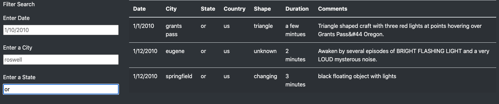

# **UFO Sightings**

## **1. Overview**
Dana's next assignment as a seasoned data journalist is to write about UFO sightings.  This is especially exciting for her as her hometown of McMinnville, Oregon is famous for UFO sightings and even hosts UFO enthusiasts annually.  

She has access to a JavaScript data file with various sighting information such as countries, cities, staties and type of sightings. Her plan is to visualize this information by displaying it in a table format and adding filters.  Finally, she'll post her article and supporting data as an HTML webpage.  

For this project, Dana has created additional filters to provide a more in-depth analysis to support her article.  We will review the results of this new search criteria and provide any drawbacks and recommendations to Dana for further development.

## **2. Results**
With the updated [UFO HTML page](index.html) visitors are now able to filter the table using multiple criteria simultaneously.  

**Search criteria process:**
- You can filter by individual criteria.  For example, if you want to see what UFO sightings occurred on 1/9/2010, you can enter the date and the table will filter all sightings for this date. 

    

- Another example is to filter by state only.  Here you can see all sightings in the state of Oregon.  

    

- You can also filter for multiple criteria at the same time.  Below you can see the result when we filter for 1/10/2010 in Norton, MA, USA for any sightings that is in the shape of a triangle.

    

## **3. Summary**
In summary, Dana has created a working webpage with dynamic tables to support her article *UFO Sightings: Fact or Fancy?*  However, there are some drawbacks of the current webpage that would greatly benefit from further development.

**Drawback of the webpage:**
- The filter works well if you already know that the dataset runs from 1/1/2010 to 1/13/2010 or that the specific shapes are disk, cylinder, formation, etc or what the specific cities are in the dataset. Users can gather this information by going through the entire data first but this defeats the purpose of a filter.  This is a big drawback of the current webpage as the filter isn't very user-friendly.  A user should be able to filter by a preset within each filter.  A dropdown menu could have helped here!

**Recommendations for further development:**
- The current webpage does not offer up-to-date information.  There should be a function added giving the users the ability to add sightings on the website.  This would make the website more relevant and interactive.

- Another recommendation for further development would be to add the ability to add an image of the sightings if available.  This will help to verify the sightings and add more interest to the webpage.  Users will be able to see for themselves if the UFO sightings is a *Fact* or *Fancy*.
